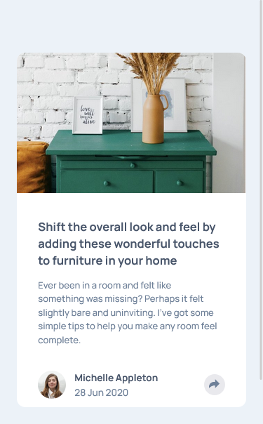
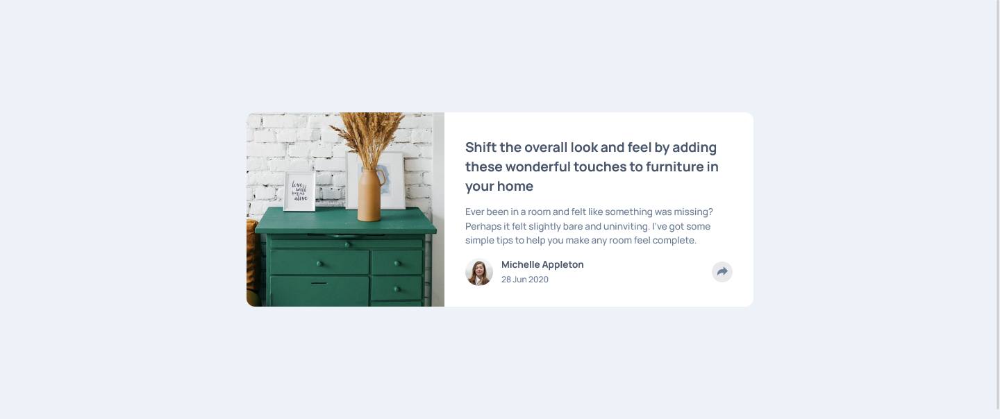

# Frontend Mentor - Article preview component solution

This is a solution to the [Article preview component challenge on Frontend Mentor](https://www.frontendmentor.io/challenges/article-preview-component-dYBN_pYFT). Frontend Mentor challenges help you improve your coding skills by building realistic projects. 

## Table of contents

- [Overview](#overview)
  - [The challenge](#the-challenge)
  - [Screenshot](#screenshot)
  - [Links](#links)
- [My process](#my-process)
  - [Built with](#built-with)
  - [What I learned](#what-i-learned)
  - [Continued development](#continued-development)
  - [Useful resources](#useful-resources)
- [Author](#author)
- [Acknowledgments](#acknowledgments)

## Overview

### The challenge

Users should be able to:

- View the optimal layout for the component depending on their device's screen size
- See the social media share links when they click the share icon
- different share layout for desktop and mobile devices

### Screenshot

#### Mobile Design

 

#### Desktop Design

### Links

- Solution URL: [Add solution URL here](https://your-solution-url.com)
- Live Site URL: 

## My process

### Built with

- Semantic HTML5 markup
- CSS custom properties
- Flexbox
- CSS Grid
- Mobile-first workflow

### What I learned

* i learn how to create basic shapes using css, like the arrow pointing down on share state for desktop.

* i also learn basic of css grid layout

* how to zoom in an image using tansform: scale() [css-trick](https://css-tricks.com/zooming-background-images/)

* to position the image hero i use the transform: translateX()
[developer mozila](https://developer.mozilla.org/en-US/docs/Web/CSS/transform-function/translateX)

* css flex for author information
[css-tricks](https://css-tricks.com/snippets/css/a-guide-to-flexbox/)

* how to use adjacent sibling selector
[developer mozila]https://developer.mozilla.org/en-US/docs/Web/CSS/Adjacent_sibling_combinator

i also that you cant define scale() and translate seperately for one element. 

### Continued development

I like to further my knowledge about css animation

## Author

- Github - [Neomill](https://github.com/Neomill)
- Frontend Mentor - [@neomill](https://www.frontendmentor.io/profile/Neomill)
- Gmail - [Neomill Marc Reas](rneomillmarc@gmail.com)

